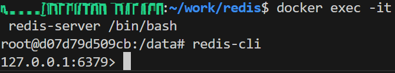

# 概要
redisの概要とユースケース毎の実装を試すだけ

# 環境構築
## redisコンテナの起動
```
$ docker compose up -d
```
## redisクライアントへの接続
```
$ docker exec -it redis-client /bin/bash
$ redis-cli -h redis-server
// 接続後redis-cliのプロンプトに移る
redis-server:6379>
```

# 補足
## redis server-clientの構成
redisコンテナには標準でredis-clientがインストールされているので、わざわざ別コンテナからredis-cliで接続しに行く必要性はなさそう
↓単一のredisコンテナを構成してlocalhostへの接続をすることで検証自体は可能



同一の`redis-network`内のredisクライアント-サーバ間の通信という意味合いでコンテナを分けている（けどどっちもredisイメージがベースなので同じコンテナが二つ起動してる）